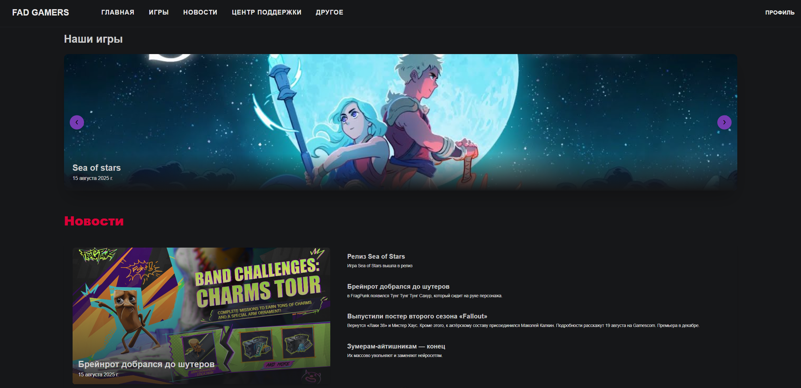
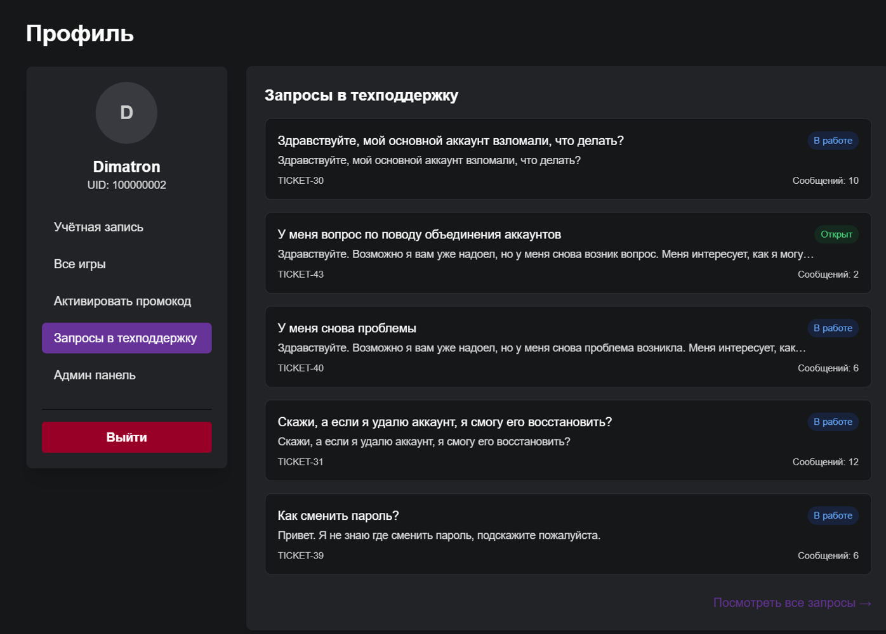
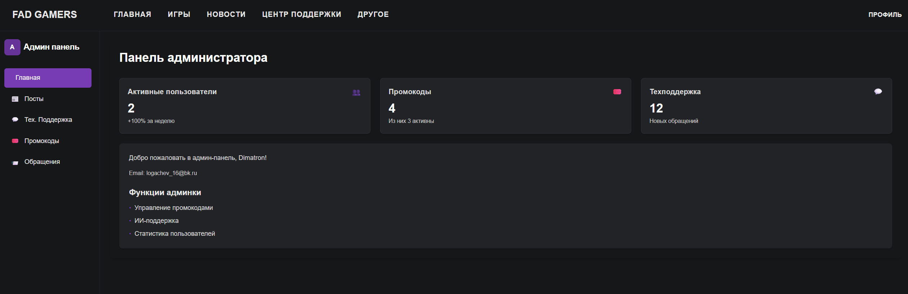
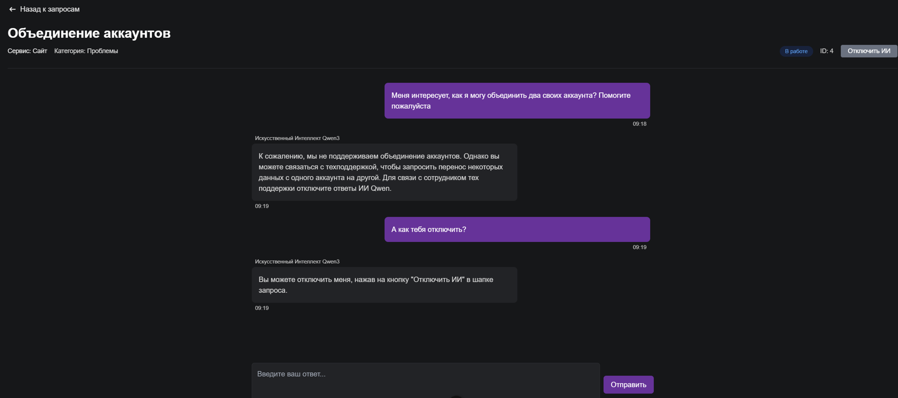

# FadGamer

# FadGamers 🎮

**FadGamers** — это полнофункциональный веб-сайт игровой студии с интеграцией искусственного интеллекта в технической поддержке и автоматизированной системой промокодов.  
Проект объединяет **Django** (backend) и **Vue.js** (frontend) в единой клиент-серверной архитектуре, а также использует **LLM Qwen3-1.7B** с технологией **RAG** для локальной обработки запросов без обращения к сторонним API.

## 🚀 Зачем нужен этот проект

- **Автоматизация техподдержки** — ИИ обрабатывает типовые запросы пользователей, экономя время сотрудников и повышая скорость ответов.
- **Гибкая система промокодов** — централизованное управление бонусами, интеграция с игровыми клиентами.
- **Многоязычность** — поддержка интерфейса на нескольких языках через i18n.
- **Масштабируемость** — архитектура позволяет легко расширять функционал и интегрировать новые сервисы.
- **Полный контроль данных** — LLM и база знаний работают локально, обеспечивая безопасность и независимость.

## 🎯 Кому будет полезен

- **Игровым студиям** — как готовый шаблон сайта с автоматизацией поддержки и маркетинговых инструментов с предполагаемой дальнейшей доработкой.
- **Веб-разработчикам** — как пример интеграции Django + Vue.js + LLM в едином проекте.
- **Студентам** — как учебный проект по веб-разработке и ИИ.

## 📷 Скриншоты

### Главная страница
*Описание:* Приветственный экран с каруселью игр, новостями студии и информацией о компании.

---

### Профиль пользователя
*Описание:* Личный кабинет с информацией о пользователе.

Запросы пользователя в тех поддержку в профиле.

---

### Административная панель
*Описание:* Управление играми, новостями, промокодами, модерация обращений в техподдержку.

---

### Чат с ИИ в технической поддержке
*Описание:* Автоматические ответы от LLM Qwen3-1.7B с технологией RAG, возможность переключиться на оператора.

## ⚙️ Функционал

FadGamers состоит из набора взаимосвязанных подсистем, каждая из которых отвечает за свою часть работы сайта.

### 🔑 Подсистема профилей
- Регистрация и авторизация пользователей (JWT).
- Редактирование личных данных и аватара.
- История обращений в техподдержку.
- Список продуктов и игр, в которых аккаунт пользователя зарегистрирован.

### 🎁 Подсистема промокодов
- Создание и управление промокодами через админ-панель.
- Проверка срока действия.
- Интеграция с игровыми клиентами для автоматической выдачи наград.
- Ограничение по количеству активаций.

### 🕹 Подсистема игр
- Каталог игр с описанием, скриншотами и характеристиками.
- Фильтрация по жанрам и платформам.
- Быстрый переход к получению или покупке игры.

### 📰 Подсистема новостей
- Лента новостей.
- Полнотекстовый просмотр публикаций.
- Управление новостями через административную панель.
- Блочная система новостей.

### 🤖 Подсистема технической поддержки с ИИ
- Использование локальной LLM для ответов с памятью.
- Использование **RAG** и модели MiniLM для поиска контекста.
- Автоматические ответы на типовые вопросы.
- Возможность переключиться на оператора.
- Ведение истории диалогов.

### 📩 Подсистема связи с компанией
- Форма обратной связи без авторизации.
- Сохранение обращений в БД и обработка через админ-панель.
- Отправка ответов на email пользователя.

### 🛠 Административная панель на FrontEnd Vuejs
- Управление контентом.
- Модерация обращений в поддержку.
- Управление промокодами.

## 🛠 Технологии

Проект построен на современном и проверенном стеке, который обеспечивает гибкость, производительность и масштабируемость.

### Backend
- **[Django](https://www.djangoproject.com/)** — основа серверной части, управление пользователями, API, безопасность.
- **[Django REST Framework](https://www.django-rest-framework.org/)** — реализация REST API для фронтенда и игровых клиентов.
- **[PostgreSQL](https://www.postgresql.org/)** — надёжная реляционная база данных.
- **JWT аутентификация** — безопасный обмен токенами.

### Frontend
- **[Vue.js](https://vuejs.org/)** — реактивный интерфейс, компонентный подход.
- **[Vue Router](https://router.vuejs.org/)** — маршрутизация и защита страниц.
- **[Tailwind CSS](https://tailwindcss.com/)** — адаптивная и быстрая стилизация.
- **[i18n](https://kazupon.github.io/vue-i18n/)** — поддержка многоязычности.

### AI и обработка запросов
- **[Qwen3-1.7B GGUF](https://huggingface.co/unsloth/Qwen3-1.7B-GGUF)** — локальная LLM для обработки запросов без внешних API (рекомендуется).
- **RAG (Retrieval-Augmented Generation)** — генерация ответов на основе актуальной базы знаний.
- **[MiniLM ONNX](https://huggingface.co/sentence-transformers/all-MiniLM-L6-v2)** — лёгкая модель для семантического поиска.
- **FAISS** — быстрый векторный поиск.

### Прочее
- **ORM Django** — безопасная работа с базой данных.
- **Модульная архитектура** — каждая подсистема может быть вынесена в отдельный микросервис.

## 📄 Лицензия

Проект распространяется под лицензией **MIT**.  
Вы можете свободно использовать, модифицировать и распространять этот код, при условии сохранения информации об авторстве и условиях лицензии.

---

© 2025 Дмитрий Логачев

